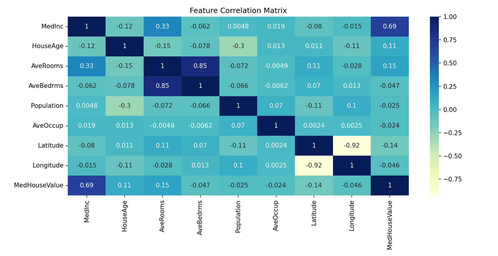

### Steps to Clone and Run the Project

1. **Clone the Repository/Directory**  
   Open your terminal and run the following command to clone the directory:

   ```bash
   git clone https://github.com/your-username/simple-aiml-project.git
   cd simple-aiml-project
   ```

2. **Install Dependencies**  
   Make sure you have Python installed on your system. Install the required Python packages by running:

   ```bash
   pip install numpy pandas scikit-learn matplotlib seaborn
   ```

3. **Run the Python Script**  
   Once the dependencies are installed, run the following command to execute the house price prediction script:

   ```bash
   python house_price_prediction.py
   ```

4. **Explore Results**  
   The script will:
   - Load and explore the Boston Housing Dataset.
   - Train a linear regression model.
   - Predict house prices.
   - Print model performance metrics (Mean Squared Error and R-squared).
   - Visualize the actual vs predicted house prices.
   - Save the trained model as `house_price_model.pkl`.

   The results will be printed in the terminal, and the actual vs predicted house prices plot will be shown.


5. **Output Results** 



---